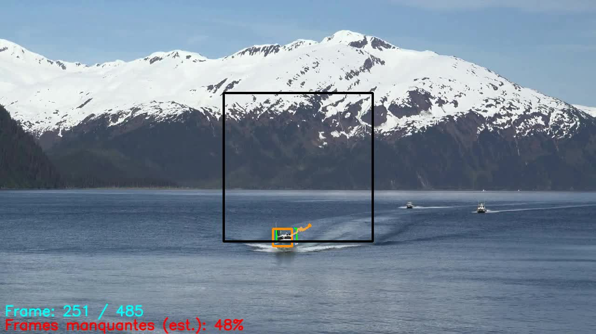
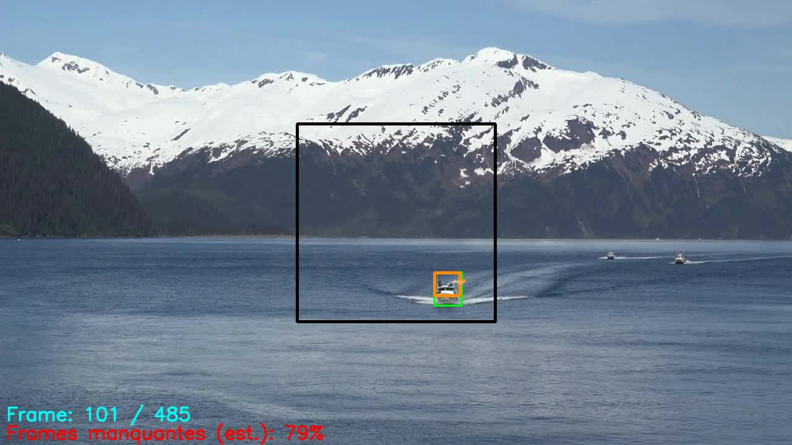
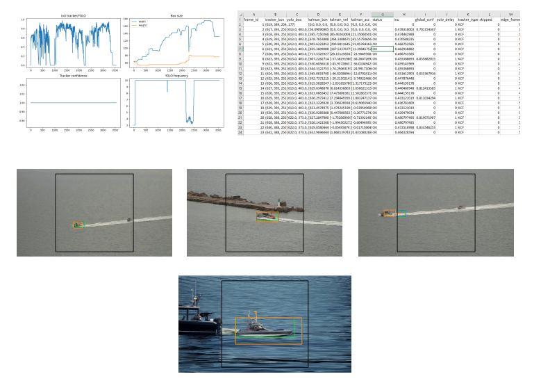
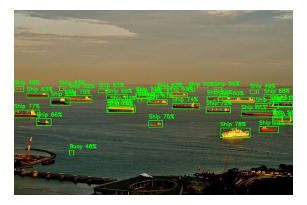
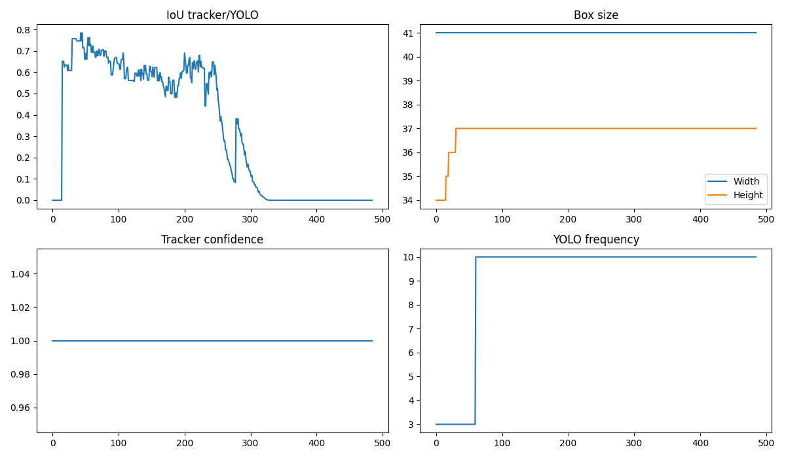

# Suivi maritime temps reel par YOLO, KCF, Kalman et ReID

Prototype de vision par ordinateur pour la detection et le suivi d'objets maritimes dans des images, des videos ou un flux camera. Le projet couvre toute la chaine de traitement : entrainement d'un detecteur YOLO, conversion ONNX, inference et tracking hybride temps reel.

<p align="center">
  
</p>

## Fonctionnalites

- detection de quatre classes : `Buoy`, `Ship`, `Sailboat` et `Drone` ;
- entrainement et evaluation de modeles YOLOv8 et YOLO11 avec Ultralytics ;
- conversion des poids PyTorch `.pt` vers ONNX ;
- inference ONNX sur des lots d'images et des videos ;
- suivi hybride combinant YOLO, KCF, prediction MultiKalman et re-identification par histogramme ;
- adaptation automatique de la frequence d'appel a YOLO ;
- export des videos annotees, journaux CSV, resumes JSON et graphiques de metriques ;
- variantes pour des crops centraux de 320 px et 640 px, sur fichier video ou webcam.

## Architecture

```text
Image ou flux video
        |
        v
Crop central 320/640 px
        |
        +------> Detection YOLO via ONNX ----+
        |                                     |
        v                                     v
Tracking KCF <---- correction / reprise ---- ReID
        |
        v
Prediction et lissage MultiKalman
        |
        v
Affichage + video + CSV + JSON + metriques
```

KCF assure le suivi rapide entre deux detections. YOLO est rappele periodiquement ou lorsque la confiance diminue. En cas de perte ou d'occlusion, les predictions Kalman et le descripteur d'apparence aident a retrouver la cible.

## Apercu ONNX

L'inference est realisee dans une zone centrale dont la taille doit correspondre a la resolution du modele exporte.

Le modele detecte les objets dans le crop puis reprojette les boites sur l'image complete. Cette approche reduit le cout de calcul tout en gardant une zone d'interet stable pour le tracking.

<p align="center">
  
</p>

## Organisation du depot

```text
.
|-- Yolo Train/
|   |-- training.py                 # entrainement Ultralytics
|   |-- test.py                     # evaluation sur un lot d'images
|   `-- boat_detection/
|       `-- data.yaml               # classes et chemins du dataset
|-- Z_Tracking/
|   |-- ONNX convertisseur.py       # export PT vers ONNX
|   |-- multi image.py              # inference ONNX sur des images
|   |-- video_onnx.py               # inference ONNX sur des videos
|   |-- Z_Soft RT Mat Tracking v4-4-2.py
|   |-- Z_Soft RT Mat Tracking v4-4-2 crop 320.py
|   |-- Z_Soft RT Mat Tracking v4-5.py
|   `-- Z_Soft RT Mat Tracking v4-5 crop 320.py
|-- docs/                           # illustrations du README
|-- requirements.txt
|-- requierement install.py         # installation avec PyTorch CUDA 11.8
`-- setup.py                        # controle des versions et de CUDA
```

Les scripts `v4-4-2` traitent des videos. Les scripts `v4-5` utilisent la webcam. Chaque famille existe en 320 px et 640 px.

## Installation

Environnement recommande : Windows, Python 3.9 a 3.12, webcam optionnelle et GPU NVIDIA optionnel.

```powershell
python -m venv .venv
.\.venv\Scripts\Activate.ps1
python -m pip install --upgrade pip
python "requierement install.py"
python setup.py
```

Le script d'installation utilise par defaut les roues PyTorch CUDA 11.8. Pour une execution CPU ou une autre version de CUDA, adaptez `TORCH_INDEX_URL` dans `requierement install.py`, ou installez PyTorch separement puis lancez :

```powershell
python -m pip install -r requirements.txt
```

## Jeu de donnees

Le fichier `Yolo Train/boat_detection/data.yaml` declare les classes dans cet ordre :

```yaml
nc: 4
names: ['Buoy', 'Ship', 'Sailboat', 'Drone']
```

Structure attendue :

```text
boat_detection/
|-- data.yaml
|-- train/
|   |-- images/
|   `-- labels/
`-- test/
    |-- images/
    `-- labels/
```

Les annotations utilisent le format YOLO : un fichier `.txt` par image, avec une ligne par objet sous la forme `class x_center y_center width height` en coordonnees normalisees.

## Entrainement

Depuis le dossier `Yolo Train` :

```powershell
cd "Yolo Train"
python training.py
```

La configuration actuelle entraine `yolo11n.pt` pendant 50 epochs, avec un batch de 8 et des images de 320 px. Modifiez `model_ckpt` et le dictionnaire `params` dans `training.py` pour tester une autre configuration.

Les sorties sont enregistrees dans `Yolo Train/runs/train/`.

## Conversion ONNX

Placez le poids entraine sous `Z_Tracking/best.pt`, puis executez depuis `Z_Tracking` :

```powershell
cd Z_Tracking
python "ONNX convertisseur.py"
```

Avant l'export, verifiez que `dim_crop` correspond a la taille d'entrainement (`320` ou `640`) et que `dst_dir` designe le bon dossier de modele. Le script valide ensuite le modele avec une inference ONNXRuntime sur un tenseur factice.

## Inference ONNX

Configurez les constantes en tete des scripts (`ONNX_PATH`, dossiers d'entree/sortie, seuils et taille d'image), puis lancez depuis `Z_Tracking` :

```powershell
python "multi image.py"
python video_onnx.py
```

Le post-traitement applique un seuil de confiance puis une suppression des doublons NMS.

## Tracking hybride

Pour une video en crop 320 px :

```powershell
cd Z_Tracking
python "Z_Soft RT Mat Tracking v4-4-2 crop 320.py"
```

Pour une webcam en crop 320 px :

```powershell
python "Z_Soft RT Mat Tracking v4-5 crop 320.py"
```

Au demarrage, selectionnez la cible avec la souris puis validez avec `Entree` ou `Espace`. Dans les variantes webcam, la touche `M` permet de selectionner une nouvelle cible et `Echap` arrete l'affichage.

Les principaux reglages se trouvent au debut de chaque script :

| Groupe | Parametres principaux |
|---|---|
| Detection | `CROP_SIZE`, `CONF_THRESHOLD`, `NMS_THRESHOLD` |
| Tracking | `TRACKER_TYPE`, `KALMAN_LISSAGE`, `KALMAN_MEM_SIZE` |
| ReID | `REID_ENABLED`, `HIST_REID_THRESHOLD`, `REID_WEIGHT` |
| Temps reel | `TARGET_FPS`, `YOLO_AUTO_FREQ`, `YOLO_FREQ_MIN`, `YOLO_FREQ_MAX` |
| Exports | `EXPORT_VIDEO`, `EXPORT_CSV`, `EXPORT_METRICS_PLOTS`, `EXPORT_SUMMARY_JSON` |

## Resultats disponibles

Les essais fournis montrent notamment le nombre de corrections YOLO, les pertes de tracking, l'IoU, l'evolution des boites et la frequence d'appel au detecteur.

<p align="center">
  
</p>

<p align="center">
  
</p>

<p align="center">
  
</p>

Exemple sur une sequence de 485 images : 61 corrections YOLO, aucune perte de tracking et 424 images traitees uniquement par le tracker. Ces valeurs illustrent une execution enregistree ; elles dependent du modele, de la video, du materiel et des seuils choisis.

## Limites connues

- le crop central limite la detection aux objets presents dans cette zone ;
- la selection initiale de la cible est manuelle ;
- la qualite du ReID par histogramme varie avec l'eclairage et les changements d'apparence ;
